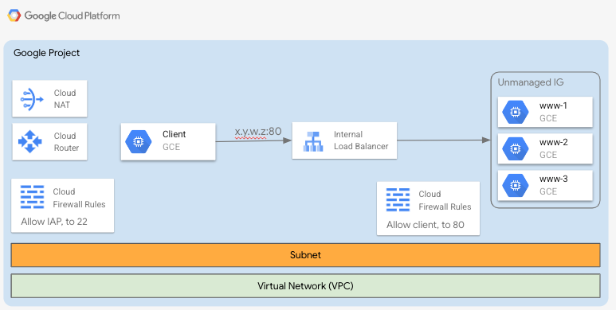
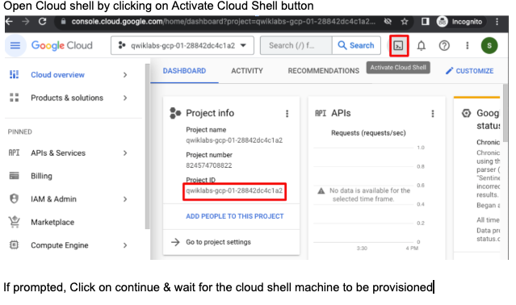
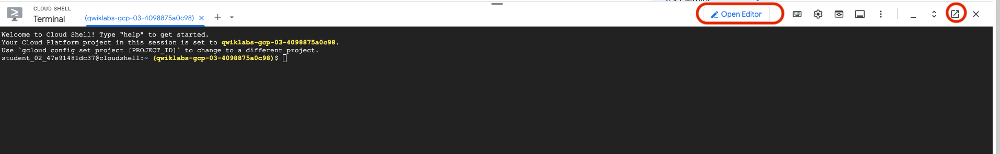

# Terraform GCP resources

# Objective
**Goal:**  To help learn on how to use Terraform to deploy GCP resources.

# Pre-requisites
 - GCP Project
 - Terraform (available by default if using cloud shell)

# Solution Details
- This repo contains recommended Terraform folder structure and sample code to deploy below Architecture in a GCP project
<ins> Recommended approach: Try to </ins>

 


# Terraform Code & Resource deployment
## Code-repos that we will use 
### 1. tf-root
This repository will have recommended terraform file structure but no terraform code
Clone this repo during the solution development and build the code through the development excersise
*** `https://github.com/go-siri/tf-root.git` ***

### 2. tf-root-code 
This is the repo with all code references and instructions
Use this repo for code reference (
For best learning, recommned to try to write your own code and use this repo for validation only
*** `https://github.com/go-siri/tf-root-code.git` *** 
## Set-up Instructions
- Login to GCP project

   

- Clone the github repo using `git clone https://github.com/go-siri/tf-root.git`
- Swtich to root directory once cloned using `cd tf-root`
- Open Cloud Shell editor in a new window by clicking on Open Editor button as shown below 

 

## Initialize working directory and install required providers
- Create & Downlaod Terraform root module structure 
```
git clone https://github.com/go-siri/tf-root.git
```
<ins> This repository will downlaod all the files to start with. These files are empty and doesnt not have any code. </ins>

- Update **providers.tf** file with the code to define Google as required provider
- [Provider Requirements] https://developer.hashicorp.com/terraform/language/providers/requirements
- [Google Provider] https://registry.terraform.io/providers/hashicorp/google/latest/docs
- Initialize the directory to install all required providers using command
        `Terraform init`

## Define GCP resources and their configuration

### 1. Update **main.tf** file with the code to create the following components
#### 1.1 Create a VPC "my-vpc" in your GCP project [VPC](https://registry.terraform.io/providers/hashicorp/google/3.17.0/docs/resources/compute_network)
     
#### 1.2 Create a Subnet "my-subnet" in "my-vpc" [Subnet Resource](https://registry.terraform.io/providers/hashicorp/google/latest/docs/resources/compute_subnetwork)
     
#### 1.3 Create a firewall rule to allow http traffic with following configuration [Firewall Resource](https://registry.terraform.io/providers/hashicorp/google/latest/docs/resources/compute_firewall) 

- port: 80
- protocol: http
- source range: 192.168.0.0/24
- target_tags = ["www"]

#### 1.4 Create a firewall rule to allow iap tcp forwarding with below configuration 
- port: 22
- Source IP range: 35.235.240.0/20

#### 1.5 Create a compute instance with following configuration [Goolge compute](https://registry.terraform.io/providers/hashicorp/google/latest/docs/resources/compute_instance)
- name: instance1
- machine type: "e2-micro"
- zone: us-central1-b"
- image: debian-cloud/debian-11

#### 1.6 Run `terraform plan` and validate the output. 
It should show 5 resources to be added, 0 to be changed & 0 to be destroyed

#### 1.7 Run ` terraform apply` to deploy all the above resources

### 2. Global and Local Variables, Loops (count & for_each, for), Output & Conditional Operator "?"

#### 2.1 Define following variables in variables.tf [Variables](https://developer.hashicorp.com/terraform/language/expressions/types)
- **vm_name**  type:string, description: This will represent the VM name
- **region**  type:string, description: To specify the region that will be used, set default value to **us-central1**
- **is_amd**  type: bool, description:  To specify which machine platofrm to use (Intel / AMD)
- **disk_count** tpye: number, description: To specify number of pd_standard disks are created 
- **web_instances** type: map/object, description: contains a list of webserver names as keys (e.g. web-server1, web-server2, web-server3) & associated machine_types (e.g.e2-medium, e2-small, e2-medium)

#### 2.2 Update terraform.tfvars file and provide values to some of the above variables
```
vm_name = vm-instance2
is_amd = true
disk_count = 3
web_instances = {
    web-server1 = {
    machine_type = "e2-medium"
    }
    
    web-server2 = {
    machine_type = "e2-small"
    }
    
    web-server3 = {
    machine_type = "e2-medium"
    }
}
```
#### 2.3 Continue editing main.tf to configure

##### 2.3.1 **Local Variable** 
Define a local variable gce_zone and set the value to "us-central1-b"

##### 2.3.2 **Learn varibale usage & conditional operator** 
Create Compute Instance using following configuration
- name: use global varaiable vm_name defined in variables.tf 
- Zone: use local varialbe gce_zone defined above
- image: debian-cloud/debian-11
- machine_type: if is_amd = true then use use "n2d-standard-2" else use "n2-standard-2" (use conditional operator "?")   [Conditional Expression](https://developer.hashicorp.com/terraform/language/expressions/conditionals)

##### 2.3.3 **Count**
Create Disks
- Use Count to create number of disks specified in varaible **disk_count**
- name: use count.index as suffix to create unique disk name e.g. "disk-${count.index}"
- type: pd-standard
- zone: local gce_zone variable defined above
- size: 10 (This will be in GB)

##### 2.3.4 **for_each loop**
Create 3 web server instances using the variable web_instances
- Use for_each and set it to use variable web_instances
- name: object key
- machine_type = object value
- zone: local gce_zone variable
- image: debian-cloud/debian-11
- tags: www

##### 2.3.5 **for**
Create unamanged instace group and add all 3 webservers
- name: my-webservers
- instances: use for loop to go through the above 3 webservers and include self_link to those objects
- named_port: http, 80
- zone: local gce_zone variable value

##### 2.3.6 **Output**
Update Output file to capture 
- instance1 & instance 2 names
- disk self links
- webservers ip addresses

##### 2.3.7 Validate the resource 
Validate the resources that will be deployed using ` Terraform plan ` (8 to add, 0 to change, 0 to destroy)

##### 2.3.8 Deploy the resources
Create the resources using ` Terraform apply -auto-approve `

### 3. External Module Reference 

#### 3.1 Define module to create internal load balancer using the 
- source module: "github.com/GoogleCloudPlatform/cloud-foundation-fabric//modules/net-lb-int"
- region: global variable region defined in variables.tf
- backends: refer to the unmanaged instance group self link created above
- inlcude health check config to check port 80

3.2 Define module to create a NAT isntace using
- source:  "github.com/GoogleCloudPlatform/cloud-foundation-fabric//modules/net-cloudnat"
- region: global variable region defined in variables.tf
- router_network: vpc self link

3.3 Finally create a firewall rule to allow health check data pass through from IAP servers
- source_ranges: ["35.191.0.0/16", "130.211.0.0/22"]
- target_tags: www
- allow: http, 80

3.4 Validate the resource that will deployed using  ` Terraform plan` 8 to add, 0 to change, 0 to destroy

3.5 Deploy/Create the resources using `Terraform apply -auto-approve` 

### 4. Create a Client VM using gcloud command
#### 4.1 Switch to cloud shell and create a client vm using the following gcloud command. 
Replace project_id, vpc_id & subnet_id with your environment/project specific values
```
gcloud compute instances create my-client \
--project="<project_id>" \
--image-project=debian-cloud \
--image-family=debian-11 \
--machine-type=e2-micro \
--zone=us-central1-b \
--network="<vpc_id>" \
--subnet="<subnet_id>" \
--no-address \
--no-service-account \
--no-scopes
```

#### 4.2 Now that we created the client vm manually, lets see how we can update Terraform state file to include this information so we can use Terraform to manage this along with other resources

In Main.tf create a new compute instance resource as below with replacing project specfic values as needed

```
resource "google_compute_instance" "my_client" {
  name         = "my-client"
  project      = google_compute_network.my_vpc.project
  machine_type = "e2-micro"
  zone         = "us-central1-b"

  boot_disk {
    initialize_params {
      image = "debian-cloud/debian-11"
    }
  }
  network_interface {
    network    = google_compute_network.my_vpc.id
    subnetwork = google_compute_subnetwork.my_subnet.id
  }
}
```
#### 4.3 Now lets import the client instance create earlier by using terraform import command
```
terraform import google_compute_instance.my_client \
projects/<YOUR_PROJECT_ID>/zones/us-central1-b/instances/my-client
```
###  5. Transfer Terraform state from local to remote (to Cloud storage bucket)  

#### 5.1 Create a GCE bucket
Use resource 'google_storage_bucket'

#### 5.2 Update backend.tf with backend configuration pointing to created storage bucket
e.g. 
```
terraform {
    backend "gcs" {
    bucket = "YOUR_BUCKET_NAME"
    prefix = "terraform/state"
    }
}
```

#### 5.3 Finally transfer local state to storage bucket by running command 
```
terraform init [-migrate-state]
```

#### 5.4 Verify the new state with command 
```
cat .terraform/terraform.tfstate
```
    
Verify for your cloud storage bucket name in the output	
"backend": {
    "type": "gcs",
    "config": { ...
    "bucket": "YOUR_BUCKET_NAME",
    ......

### 6. Optionally try the below steps to complete the lab

#### 6.1 Migrate TFstate from remote to local

#### 6.2 Destroy all resources created using ```terraform destroy```